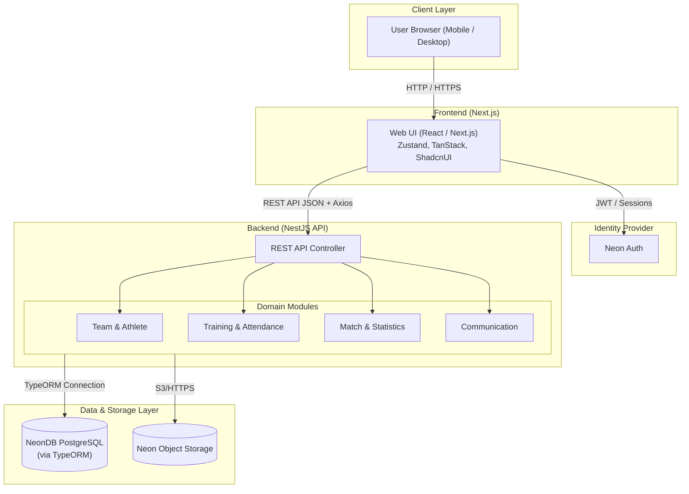
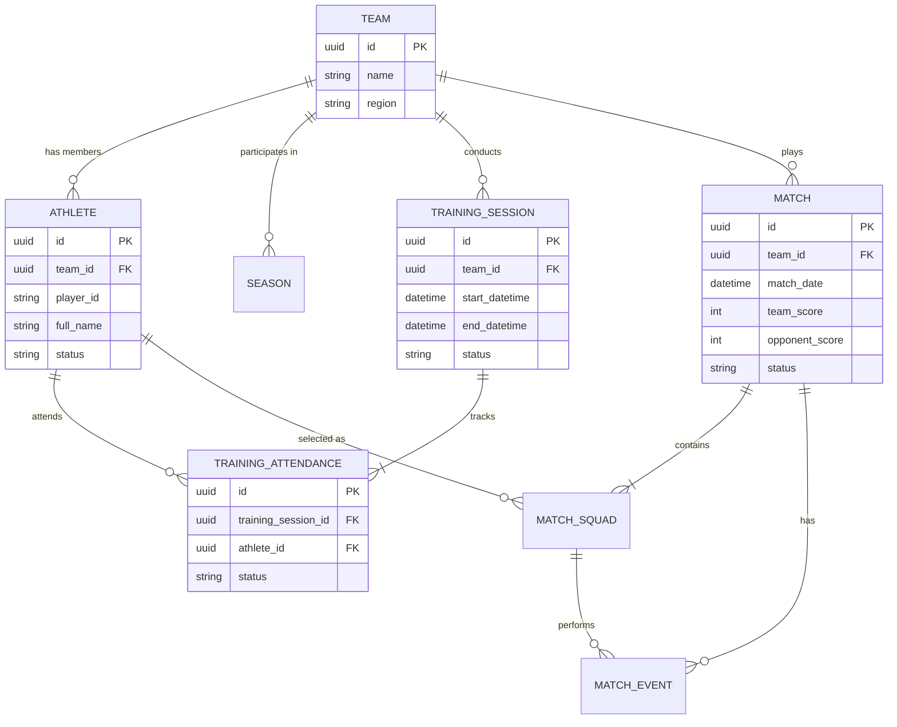

# KORFBALL BANTUL TEAM MANAGEMENT SYSTEM — Arsitektur Sistem
### Modular Monolith (Next.js + NestJS)

| Metadata Dokumen | Nilai |
|------------------|-------|
| **Versi** | 1.0 |
| **Tanggal Terbit** | 2026-10-08 |
| **Pola Arsitektur** | Modular Monolith |
| **Arsitek / Penulis** | Tim Engineering & AI Agent |
| **Status Dokumen** | Approved |

---

## 1. Gambaran Umum Arsitektur (High-Level Architecture)

### 1.1 Deskripsi Gaya Arsitektur
Sistem ini menggunakan gaya arsitektur **Modular Monolith** dengan pemisahan yang jelas antara Frontend dan Backend.
Frontend dibangun dengan **Next.js** (berjalan pada Node.js/Browser) yang akan berkomunikasi dengan Backend **NestJS** via REST API (JSON). 
Autentikasi diurus menggunakan **Neon Auth**, sementara persistensi data menggunakan **NeonDB PostgreSQL Cloud** dengan **TypeORM**. File/dokumen disimpan pada **Neon Object Storage**. Pendekatan modular monolith pada backend (NestJS modules) dipilih agar implementasi MVP tetap sederhana namun domain tetap terpisah jelas (misalnya modul Auth, Team, Match, Attendance).

### 1.2 Diagram Arsitektur Tingkat Tinggi



---

## 2. Katalog Komponen & Tanggung Jawab Layanan

### 2.1 Next.js Web App (Frontend)
| Aspek | Spesifikasi & Keterangan |
|-------|--------------------------|
| **Port Default** | HTTP: `3000` |
| **Tech Stack** | Next.js, TypeScript, TailwindCSS, ShadcnUI, React Hook Form, Zod, Zustand, TanStack Query |
| **Peran Utama** | Rendering UI (SSR & CSR), Form submission, Routing, State Management |
| **Batasan Arsitektural** | **NO DIRECT DB ACCESS**. Seluruh manipulasi data harus via NestJS API. |
| **HTTP Client** | Axios dengan Global Interceptor (untuk injeksi token Neon Auth & Error Handling). |

### 2.2 NestJS API (Backend)
| Aspek | Spesifikasi & Keterangan |
|-------|--------------------------|
| **Port Default** | HTTP: `4000` |
| **Tech Stack** | Node.js, NestJS, TypeScript, TypeORM |
| **Domain & Tanggung Jawab** | Validasi aturan bisnis (Business Rules PRD), autentikasi endpoint, penghitungan statistik, CRUD entity utama. |
| **Akses Database** | Mengelola seluruh operasi database ke NeonDB. |

---

## 3. Skema & Model Data (Database Schema)

### 3.1 Entity Relationship Diagram (ERD) Ringkas



> ℹ️ **Catatan**: Atribut kalkulasi seperti `Attendance Rate` dan `Win Rate` tidak disimpan di tabel, melainkan dihitung runtime oleh service NestJS.

---

## 4. Struktur Internal Service & Desain Layer

### 4.1 Standar Struktur Folder Proyek (Monorepo)

```text
korfball-hub/
├── apps/
│   ├── web/                          ← Next.js Frontend
│   │   ├── src/
│   │   │   ├── app/                  ← App Router Pages
│   │   │   ├── components/           ← Shadcn UI & Custom Components
│   │   │   ├── lib/                  ← Axios Interceptors, Zod schemas
│   │   │   ├── store/                ← Zustand stores
│   │   │   └── hooks/                ← TanStack Query hooks
│   │   └── package.json
│   │
│   └── api/                          ← NestJS Backend
│       ├── src/
│       │   ├── modules/              ← Domain Modules (Team, Match, Auth)
│       │   │   └── match/
│       │   │       ├── match.controller.ts
│       │   │       ├── match.service.ts
│       │   │       └── entities/
│       │   ├── common/               ← Filters, Interceptors, Guards
│       │   ├── config/               ← TypeORM & Env config
│       │   └── main.ts               ← Entry point
│       └── package.json
│
├── package.json                      ← Monorepo Root (Turborepo/npm workspaces)
└── README.md
```

---

## 5. Keputusan Desain & Arsitektur (ADR)

### ADR-01: Pemilihan Framework Backend
- **Konteks**: Membutuhkan arsitektur yang bersih, modular, dan strongly typed.
- **Keputusan**: **NestJS**.
- **Alasan & Trade-Off**: Menyediakan struktur out-of-the-box (Controllers, Services, Modules) yang mencegah *spaghetti code* dan cocok untuk typescript monorepo.

### ADR-02: HTTP Client & State Management di Frontend
- **Konteks**: Kebutuhan mengelola cache API, loading state, form validation.
- **Keputusan**: **TanStack Query + Axios** untuk *server state*, **Zustand** untuk *client state*, **React Hook Form + Zod** untuk *form*.
- **Alasan & Trade-Off**: Mengurangi boilerplate *useEffect* secara masif dan memberi *type-safety* *end-to-end* yang lebih baik jika dikombinasikan dengan Zod.

### ADR-03: ORM & Database
- **Konteks**: Interaksi dengan NeonDB PostgreSQL.
- **Keputusan**: **TypeORM**.
- **Alasan & Trade-Off**: TypeORM terintegrasi sangat mulus secara *native* pada modul NestJS (@nestjs/typeorm). Fitur Active Record dan Data Mapper yang *mature*.

---

## 6. Alokasi Port & Jaringan

| Komponen Sistem | Protokol | Port Lokal | Rute / Base URL |
|-----------------|----------|------------|-----------------|
| **Next.js Web** | HTTP | `3000` | `http://localhost:3000` |
| **NestJS API** | HTTP | `4000` | `http://localhost:4000/api/v1` |
| **NeonDB** | TCP/IP | `5432` | Koneksi via URI Cloud |
