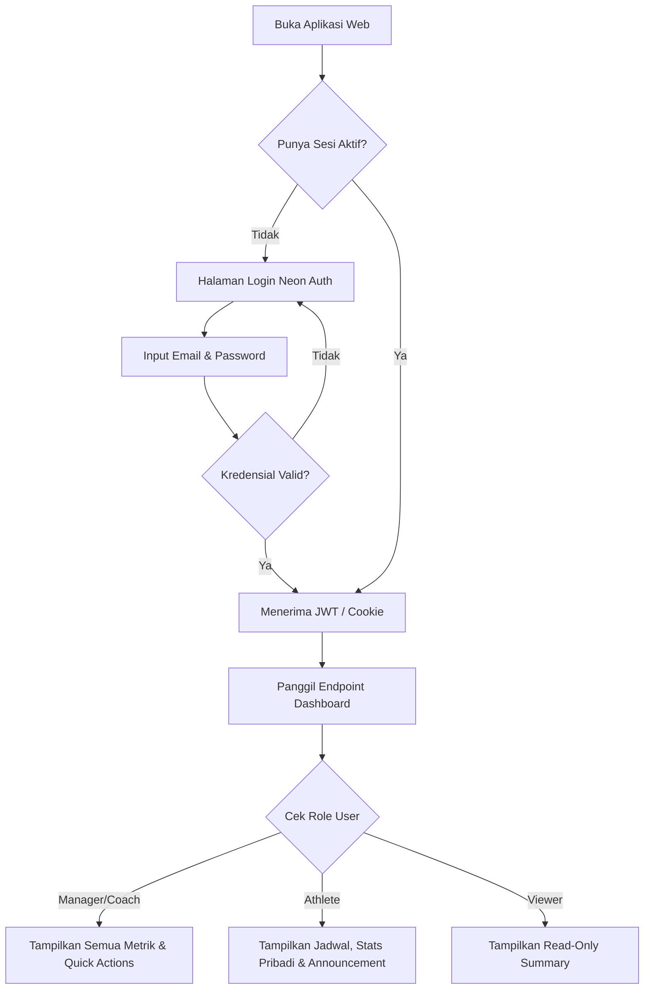
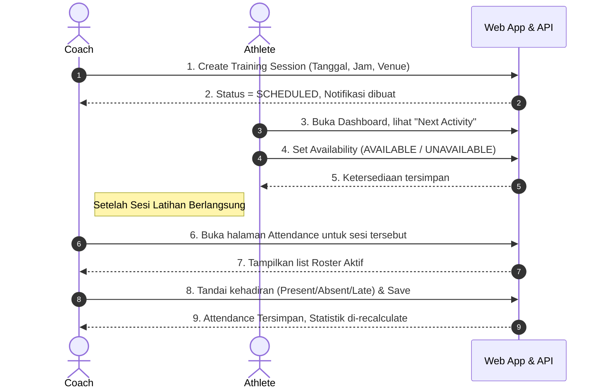
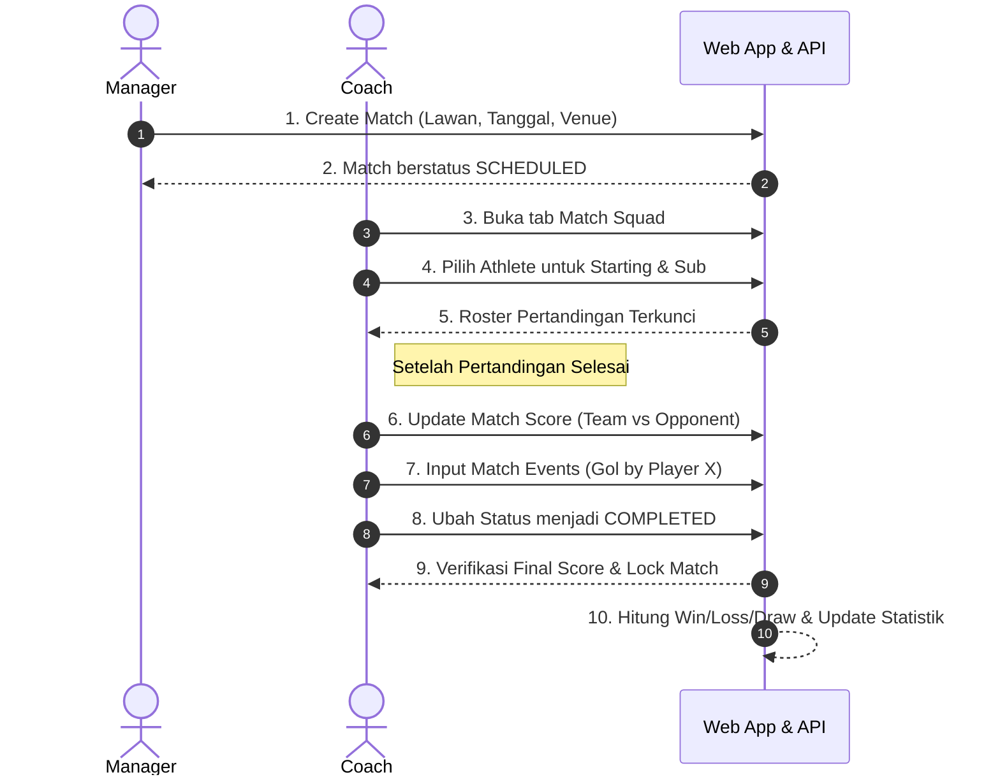
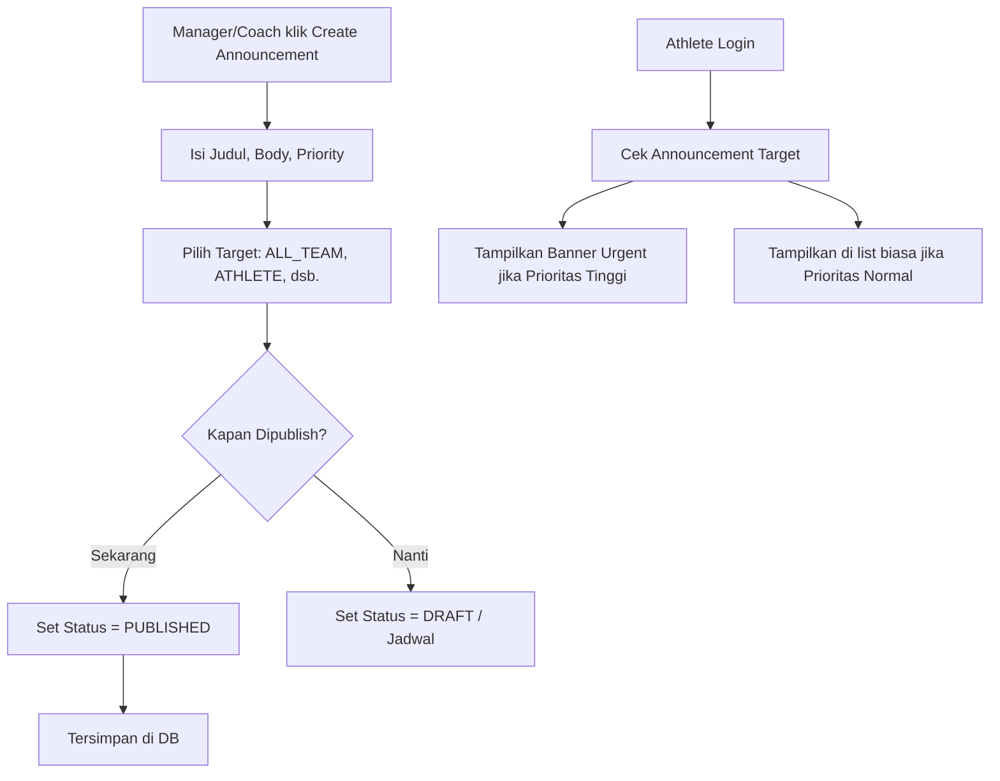

# KORFBALL BANTUL TEAM MANAGEMENT SYSTEM — User Flow

Dokumen ini memetakan alur interaksi logis dari sudut pandang *user journey* untuk fitur-fitur kritikal pada MVP, berdasarkan PRD dan Architecture yang telah disetujui.

---

## 1. Flow Otentikasi dan Dashboard (All Roles)



---

## 2. Flow Persiapan Latihan (Training Workflow)

Alur di mana pelatih membuat jadwal, pemain konfirmasi, dan pelatih mencatat kehadiran sesudahnya.



---

## 3. Flow Pencatatan Pertandingan (Match Workflow)

Alur end-to-end pembuatan pertandingan, penentuan skuad, dan input hasil akhir.



---

## 4. Flow Komunikasi (Announcement)



---

## 5. Flow Ekspor Data & Pelaporan (Reporting)

```mermaid
flowchart LR
    A[Manager Akses Menu Reports] --> B[Pilih Jenis Laporan (Absensi/Match)]
    B --> C[Set Filter: Season, Date Range, Status]
    C --> D[Klik Export CSV]
    D --> E[Next.js Panggil API NestJS `/export`]
    E --> F[NestJS Query ke PostgreSQL dengan Filter]
    F --> G[NestJS Generate File Stream (CSV)]
    G --> H[Next.js Trigger Download di Browser Manager]
```
